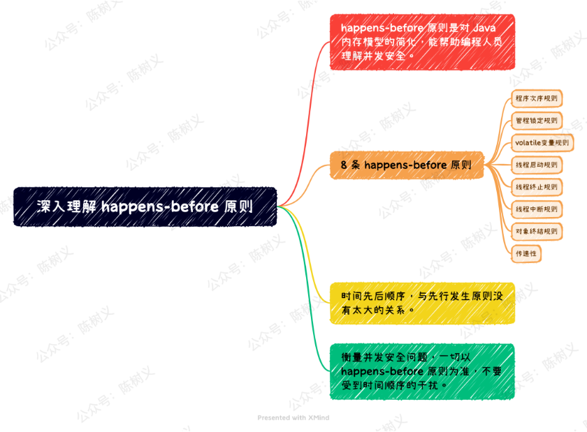

# Volatile关键字详解


##  `voliate 关键字为什么可以解决可见性和指令重排？`

我们知道volatile可以保证共享变量的可见性和防止指令重排序，但是不能保证原子性

**可见性**

- volatile关键字修饰的共享变量可以提供这种可见性规范,也叫做读写可见.
- 被volatile关键字修饰的共享变量转换成汇编语言时,会加上一个以lock为前缀的指令,当CPU发现这个指令时,立即将当前内核高速缓存行的数据回写到内存,同时使在其他内核里缓存了该内存地址的数据无效.
- 另外，在早期的 CPU 中，是通过在总线加 LOCK# 锁的方式实现的，但这种方式开销较大。所以Intel开发了缓存一致性协议，也就是 [MESI 协议](../MESI/index.md)，该解决缓存一致性。

**指定重排**

```java
public volatile boolean sign;
    descriptor: Z
    flags: ACC_PUBLIC, ACC_VOLATILE
    
```

- 从字节码层面，添加 ACC_VOLATILE，在汇编指令的打印会有 `lock addl $0x0,(%rsp)s`
- 从 JVM 层面，JMM 提供了8个 Happen-Before 规则来约束数据之间竞争、4个内存屏障 (LL LS SL SS)和As-if-serial
- 从硬件层面，sfence、lfence、mfence


## 什么是 happens-before？

happens-before 指的是 Java 内存模型中两项操作的顺序关系。例如说操作 A 先于操作 B，也就是说操作 A 发生在操作 B 之前，操作 A 产生的影响能够被操作 B 观察到。这里的「影响」包括：内存中共享变量的值、发送了消息、调用了方法等。

举个很简单的例子：下面代码里 i=1 在线程 A 中执行，而 j=i 在线程 B 中执行。因为 i=1 操作先于 j=i 执行，那么 i=1 操作的结果就应该能够被线程 B 观察到。

复制

```
// 在线程 A 中执行
i = 1;
// 在线程 B 中执行
j = i;1.2.3.4.
```

Java 内存模型下一共有 8 条 happens-before 规则，如果线程间的操作无法从如下几个规则推导出来，那么它们的操作就没有顺序性保障，虚拟机或者操作系统就能随意地进行重排序，从而可能会发生并发安全问题。

- 程序次序规则（Program Order Rule）：在一个线程内，按照程序代码顺序，书写在前面的操作先行发生于书写在后面的操作。准确地说，应该是控制流顺序而不是程序代码顺序，因为要考虑分支、循环等结构。
- 管程锁定规则（Monitor Lock Rule）：一个 unlock 操作先行发生于后面对同一个锁的 lock 操作。这里必须强调的是同一个锁，而 “后面” 是指时间上的先后顺序。
- volatile 变量规则（Volatile Variable Rule）：对一个 volatile 变量的写操作先行发生于后面对这个变量的读操作，这里的 “后面” 同样是指时间上的先后顺序。
- 线程启动规则（Thread Start Rule）：Thread 对象的 start () 方法先行发生于此线程的每一个动作。
- 线程终止规则（Thread Termination Rule）：线程中的所有操作都先行发生于对此线程的终止检测，我们可以通过 Thread.join () 方法结束、Thread.isAlive () 的返回值等手段检测到线程已经终止执行。
- 线程中断规则（Thread Interruption Rule）：对线程 interrupt () 方法的调用先行发生于被中断线程的代码检测到中断事件的发生，可以通过 Thread.interrupted () 方法检测到是否有中断发生。
- 对象终结规则（Finalizer Rule）：一个对象的初始化完成（构造函数执行结束）先行发生于它的 finalize () 方法的开始。
- 传递性（Transitivity）：如果操作 A 先行发生于操作 B，操作 B 先行发生于操作 C，那就可以得出操作 A 先行发生于操作 C 的结论。

#### 极简实践案例

Java 语言无须任何同步手段保障，就能成立的先行发生规则，就只有上面这些了。下面举个例子来说明如何用这些规则去判断操作是否具备顺序性，是否是线程安全的。

复制

```
private int value = 0;

public void setValue(int value){
    this.value = value;
}

public int getValue(){
    return value;
}1.2.3.4.5.6.7.8.9.
```

上面的代码是一组很普通的 getter/setter 方法。假设线程 A 和 B，线程 A 先（时间上的先后）调用了 setValue(1)，之后线程 B 调用了同一个对象的 getValue()，那么线程 B 收到的返回值是什么？

我们依次分析一下先行发生原则中的各项规则：

- 首先，由于两个方法分别由线程 A 和线程 B 调用，不在一个线程中，所以程序次序规则在这里不适用。
- 接着，由于没有同步块，自然就不会发生 lock 和 unlock 操作，所以管程锁定规则不适用。
- 继续，由于 value 变量没有被 volatile 关键字修饰，所以 volatile 变量规则不适用。
- 继续，后面的线程启动、终止、中断规则和对象终结规则也和这里完全没有关系。
- 最后，因为没有一个适用的先行发生规则，所以最后一条传递性也无从谈起。

因此，即使我们知道线程 A 在操作时间上先于线程 B，但我们还是无法确定线程 B getValue() 方法的返回结果。换句话说，这里面的操作不是线程安全的。

那怎么修复这个问题呢？

我们至少有两种比较简单的方案可以选择：

- 第一种，要么把getter/setter 方法都定义为synchronized 方法，这样就可以套用管程锁定规则。
- 第二种，要么把value 定义为volatile 变量，由于setter 方法对value 的修改不依赖value 的原值，满足volatile 关键字使用场景，这样就可以套用volatile 变量规则来实现先行发生关系。

通过上面这个案例，我们知道：一个操作时间上先发生，不代表这个操作会「先行发生」。 那如果一个操作「先行发生」，是否就能推导出这个操作必定是时间上先发生呢？其实并不能，因为有可能发生指令重排序。

复制

```
// 如下操作在同一个线程中执行
int i = 1;
int j = 2;
```

上述代码在同一线程中执行，根据程序执行次序规则，int i = 1; 的操作先行发生于 int j = 2;，但 int j =2 的代码有可能被处理器先执行，因为它们不相互依赖，不影响先行发生原则的正确性。

上述这两个案例综合起来证明了一个结论：时间先后顺序与先行发生原则之间基本没有太大的关系，所以我们衡量并发安全问题的时候不要受到时间顺序的干扰，一切必须以先行发生原则为准。

#### 总结

happens-before 原则一共有 8 条原则，它是对 Java 内存模型规则的简化，可以帮助编程人员提高编程效率。

时间先后顺序与先行发生原则之间基本没有太大的关系，我们衡量并发安全问题的时候不要受到时间顺序的干扰，一切必须以先行发生原则为准。


深入理解 happens-before 原则									
